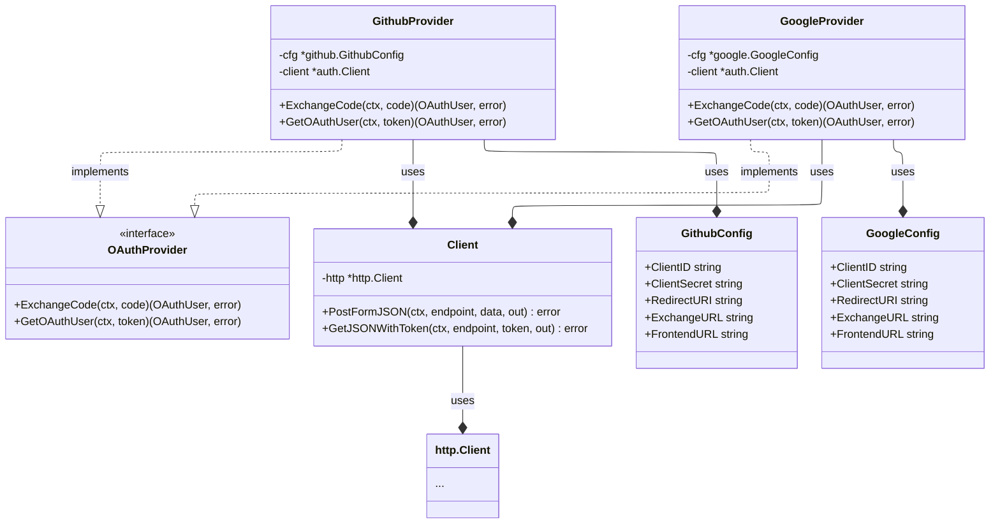
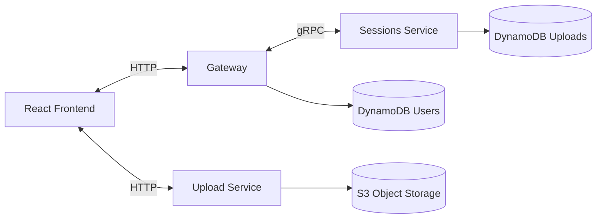
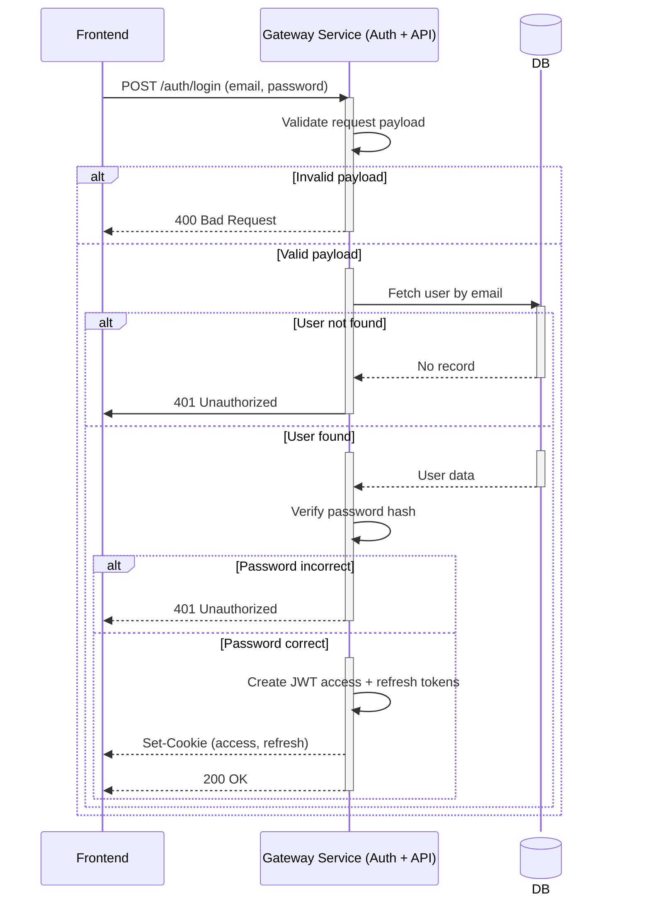
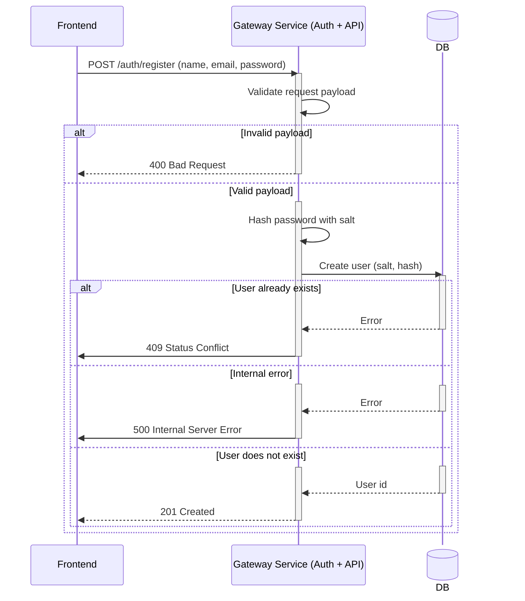
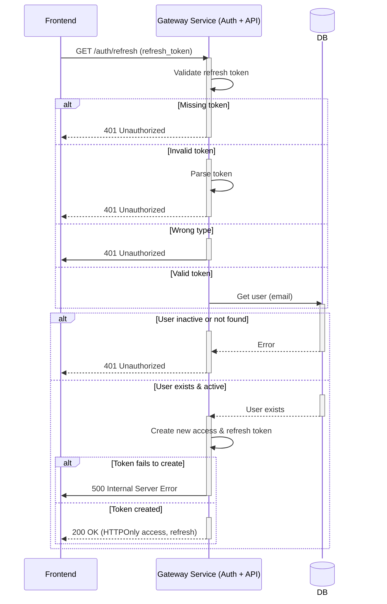
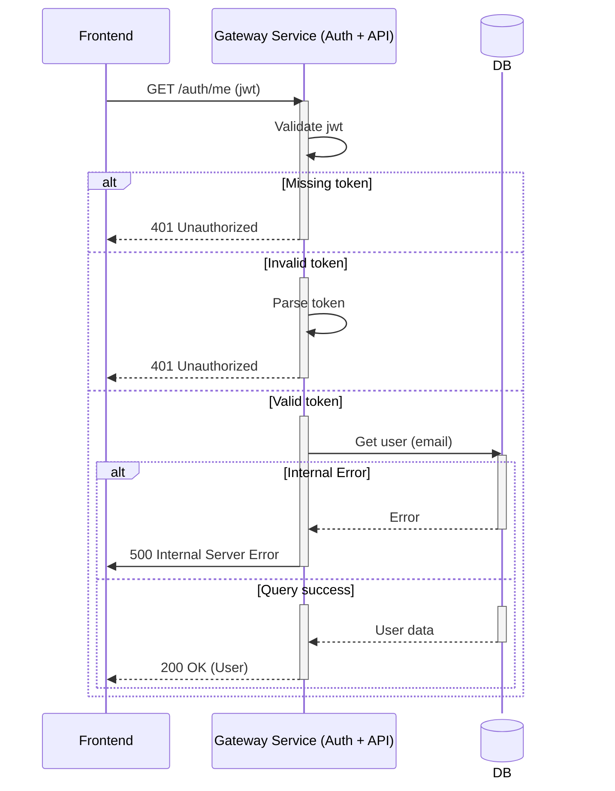

# LFUSYS

A microservices-based large file upload system with a React frontend.
The repository contains backend Go services (gateway, sessions, uploads, shared commons), Terraform infra, and a Vite + React frontend.

## Quick Summary
- Language: **Go** (backend services using **Gin** and **gRPC**) and **TypeScript/React** (frontend).
- Services: `gateway`, `sessions`, `uploads`, `commons` (shared libs).
- Infra: Terraform modules (**DynamoDB**, **S3**, **SQS**, other mandatory cloud and security services).
- Dev: **Docker Compose** for local development.

## Preview
| | | |
|:---:|:---:|:---:|
|  |  |  |
|  |  |  |

## Deployment 🚀
### Using Docker <span style="vertical-align: middle;">
</span>
This project supports two deployment modes:

- **Development mode** - with tracing, verbose logging, hot reload and observability tools.
- **Production mode** - minimal images w/o development tools and containers, optimized for performance.

#### Development mode <span style="vertical-align: middle;">
</span>
Includes:

- Structured debug logging
- Comprehensive app events logging
- OpenTelemetry tracing
- Jaeger UI
- Hot reload using Air (if enabled)
- Swagger API docs
#### Prerequisites 📦
- Docker >= 24
- Docker Compose v2

#### How to run ▶️
Running from project root:
```bash
docker compose -f docker-compose.yml up --build
```
This will start:
| Service    |   | Port            |
|------------|---|-----------------|
| gateway    |   | 8080 [exposed]  |
| sessions   |   | 50051           |
| uploads    |   | 8081 [exposed]  |
| frontend   |   | 3000 [exposed]  |
| jaeger     |   | 16686 [exposed] |
| localstack |   | 4566 [exposed]  |

WebUI access locally: http://localhost:3000

#### Production mode <span style="vertical-align: middle;">
</span>

Production mode is optimized for:

- Smaller image size
- No debug tooling
- No Swagger
- Info-level event logging
- Tracing disabled (unless explicitly enabled)
- Images are built using multi-stage Docker builds.

#### How to run ▶️
You can either pull existing images from DockerHub or build them by yourself.
#### Pull images from DockerHub:
Running from project root:
```bash
docker compose -f docker-compose.prod.hub.yml up
```
OR
#### Build the images:
Running from project root:
```bash
docker compose -f docker-compose.prod.yml up --build
```
This will start:
| Service  |   | Port           |
|----------|---|----------------|
| gateway  |   | 8080 [exposed] |
| sessions |   | 50051          |
| uploads  |   | 8081 [exposed] |
| frontend |   | 80 [exposed]   |

WebUI access locally: http://localhost

## Contents
- backend/: Go services, infra, modules, shared code
- frontend/: Vite + React app (`lfusys-app`)
- docker-compose.yml, Makefiles and per-service Dockerfiles

## How it works (high-level)
- The React frontend talks to the `gateway` service for auth and uploads session creation.
- `gateway` implements HTTP routes and delegates business logic to internal service implementations (AuthService, UploadsService). `gateway` talks to `session` service via **gRPC** to create upload session.
- `session` service persists session metadata (DynamoDB) and manages the status of upload.

**At the same time**
- Frontend breaks the whole file into chunks and upload them to `upload` service workers in parallel.
- `upload` service consists of multiple workers that validate the upload integrity, persist uploaded chunks to AWS S3 object store and update the status of upload.
- When upload is complete, last `upload` worker puts the session ID into the distributed FIFO queue (AWS SQS).
- `session` service consumes the upload sessions from the queue and creates a final `File` object using assembly-based approach for contents storage.

## Authentication
### JWT
JWT authentication is implemented under the hood with the best security practices. It is a default authentication mechanism.
### OAuth2
Third-party authentication mechanism is enabled. Users can choose among the following providers: **Github**, **Google**.
#### OAuth2 Providers UML diagram

This architecture can be improved further, but it is an overhead for the system (no more third-party auth providers will be added).

# Architecture
This section provides the diagrams for different layers of abstration in the system. It also includes design scratches `as is` to show how system changed and evolved. Initial diagrams may have flaws and may be overly opinionated, but it greatly depicts the engineer's thinking process and how can one come to a better architecture over time.

### Initial High-Level Design Sketch


## Resources
### Redis
| Usage               | Critical | On failure                                             |
|---------------------|----------|--------------------------------------------------------|
| Rate limit          | No       | Rate limit disabled                                    |
| Caching             | No       | Caching disabled. Responses are slower, more expensive |
| OAuth State Storage | No       | Frontend state is not stored. Small security breach    |

Redis is not critical for the system. It's a soft dependency for other components. Only **ONE** redis instance is fine for now to do all the work.

## Evolved Service Interactions Diagram


### UPDATED 15/01/2026


## Sequence Diagrams
Here are a few sequence diagrams that represent core auth and business logic.
### Login




### Register



### Refresh Token


### Me (User Profile)



## Contact
[Telegram](https://t.me/julianoadmin)
