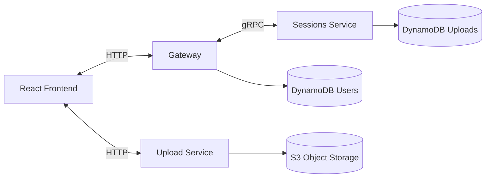
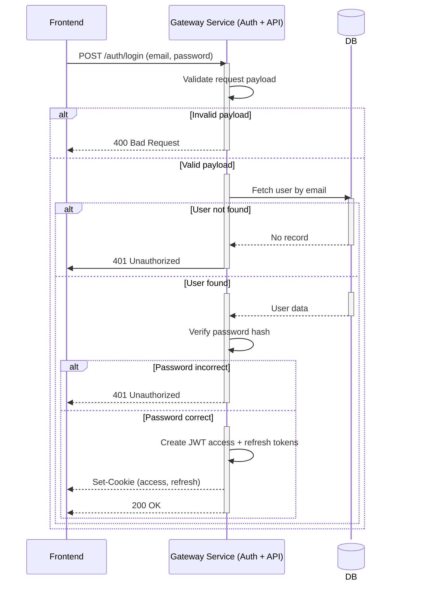
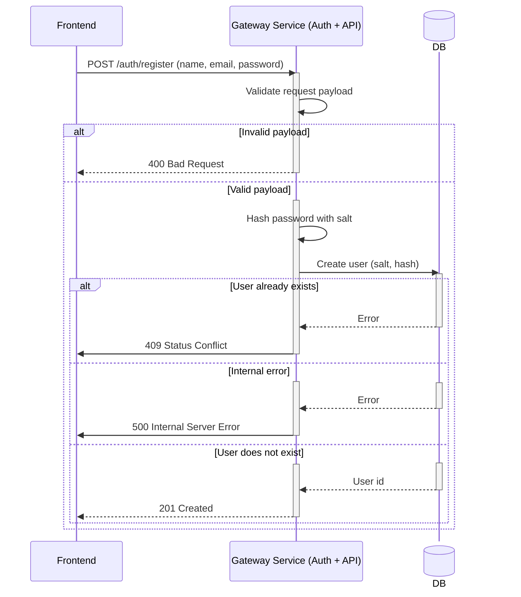
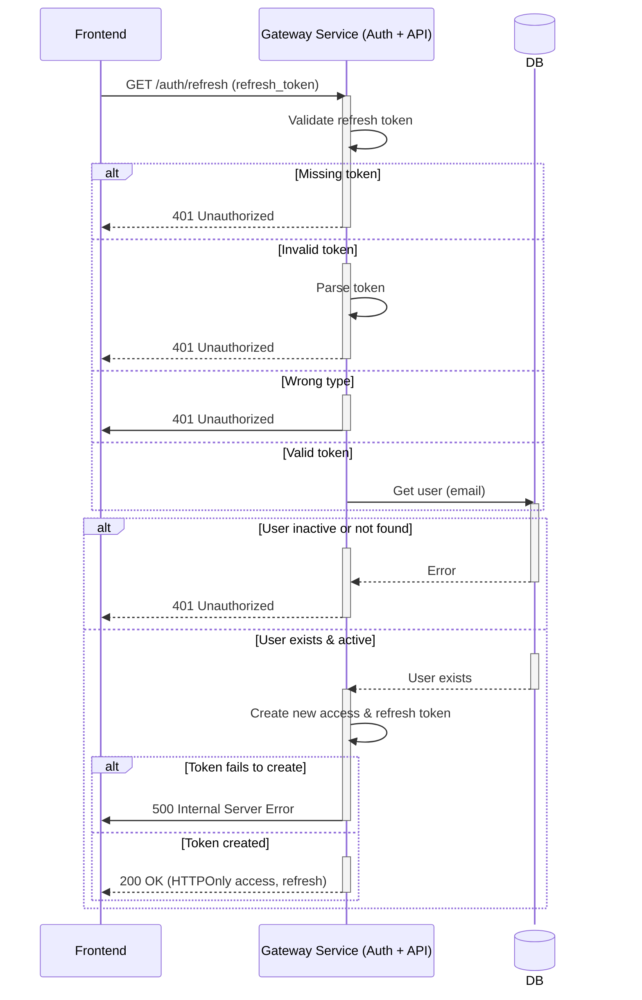
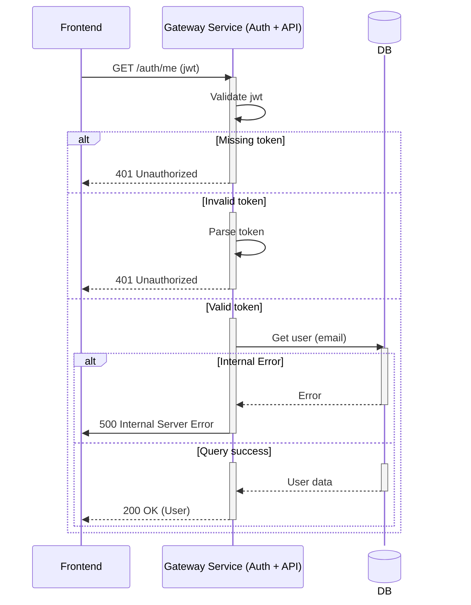

# LFUSYS

A microservices-based large file upload system with a React frontend.
The repository contains backend Go services (gateway, sessions, uploads, shared commons), Terraform infra, and a Vite + React frontend.

## Quick Summary
- Language: **Go** (backend services using **Gin** and **gRPC**) and **TypeScript/React** (frontend).
- Services: `gateway`, `sessions`, `uploads`, `commons` (shared libs).
- Infra: Terraform modules (**DynamoDB**, **S3**, **SQS**, other mandatory cloud and security services).
- Dev: **Docker Compose** for local development.

## Contents
- backend/: Go services, infra, modules, shared code
- frontend/: Vite + React app (`lfusys-app`)
- docker-compose.yml, Makefiles and per-service Dockerfiles

## How it works (high-level)
- The React frontend talks to the `gateway` service for auth and uploads session creation.
- `gateway` implements HTTP routes and delegates business logic to internal service implementations (AuthService, UploadsService). `gateway` talks to `session` service via **gRPC** to create upload session.
- `session` service persists session metadata (DynamoDB) and manages the status of upload.

**At the same time**
- Frontend breaks the whole file into chunks and upload them to `upload` service workers in parallel.
- `upload` service consists of multiple workers that validate the upload integrity, persist uploaded chunks to AWS S3 object store and update the status of upload.
- When upload is complete, last `upload` worker puts the session ID into the distributed FIFO queue (AWS SQS).
- `session` service consumes the upload sessions from the queue and creates a final `File` object using assembly-based approach for contents storage.

## Authentication
JWT authentication is implemented under the hood with the best security practices.

# Architecture
This section provides the diagrams for different layers of abstration in the system. It also includes design scratches `as is` to show how system changed and evolved. Initial diagrams may have flaws and may be overly opinionated, but it greatly depicts the engineer's thinking process and how can one come to a better architecture over time.

### Initial High-Level Design Sketch

## Evolved Service Interactions Diagram

## Sequence Diagrams
Here are a few sequence diagrams that represent core auth and business logic.
### Login

### Register

### Refresh Token

### Me (User Profile)

## Contact
[Telegram](https://t.me/julianoadmin)
