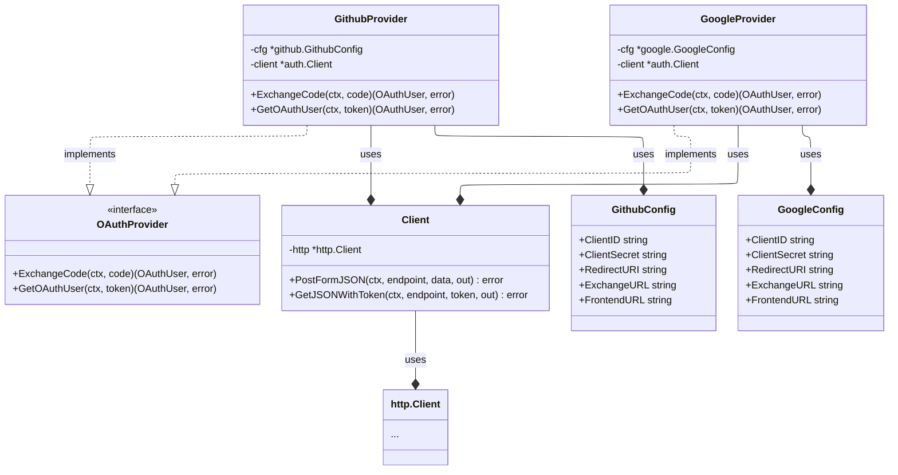
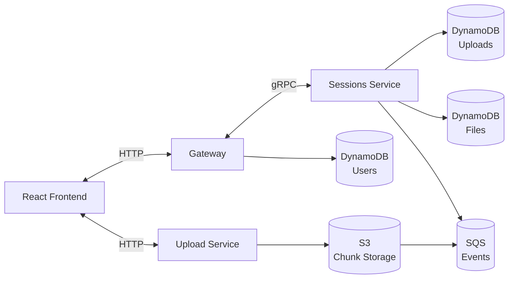
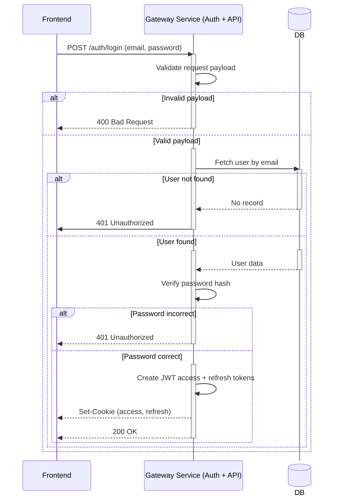
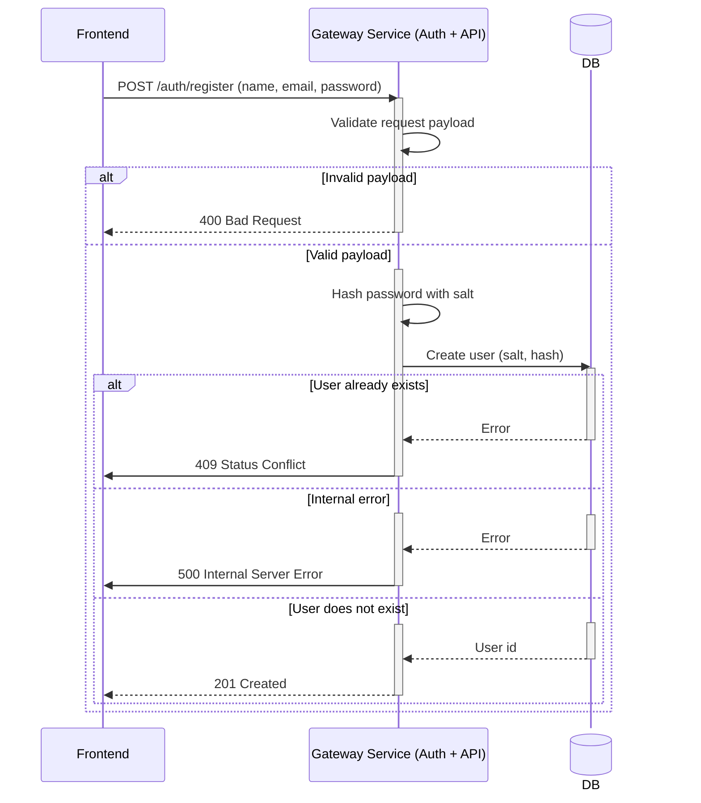
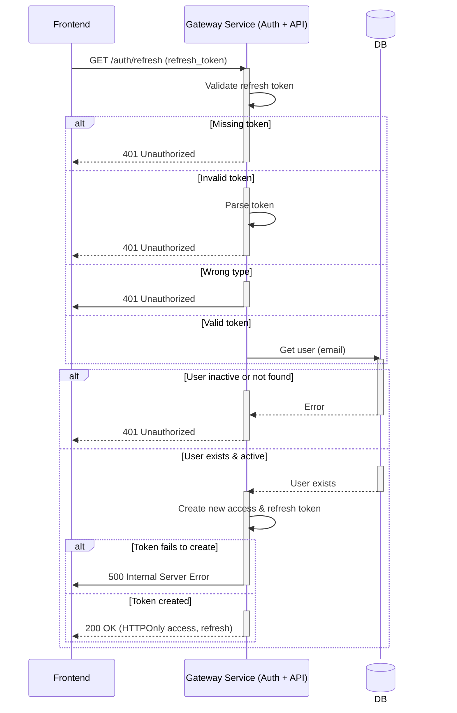
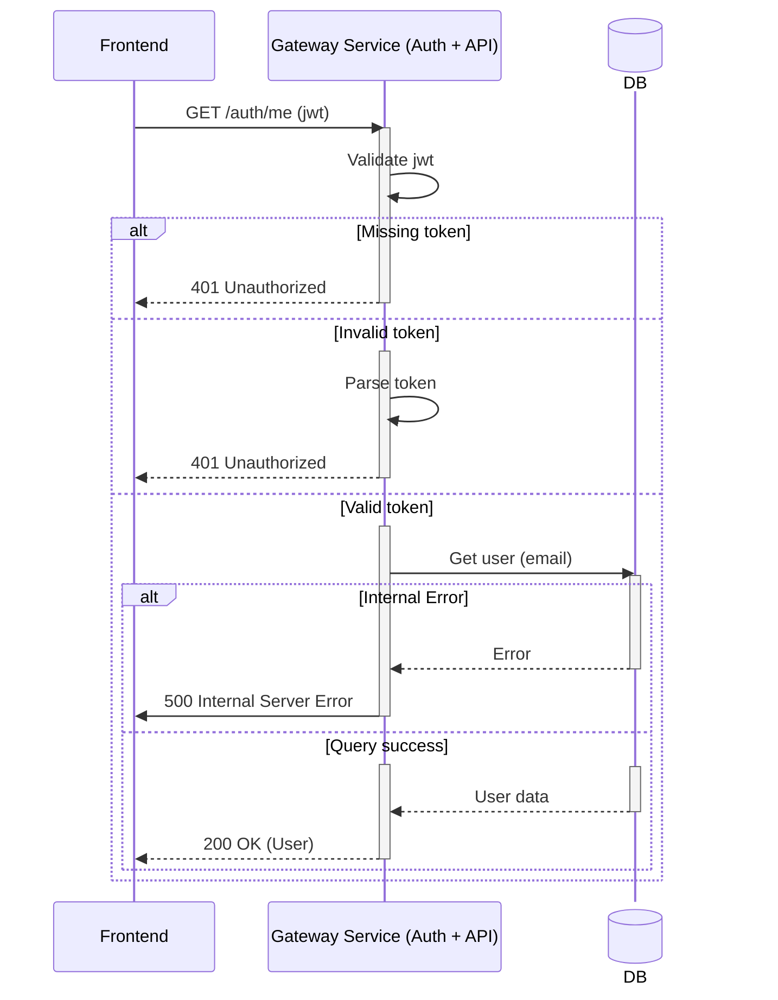

# LFUSYS

A distributed microservices-based system for large file uploads with comprehensive tracing, authentication, and cloud-native deployment options.

## 🎯 Project Overview

**LFUSYS** is a production-ready file upload system designed to handle large files efficiently through a modern microservices architecture. The backend is built with **Go**, featuring **Gin** for HTTP and **gRPC** for inter-service communication. The frontend is a responsive **React + TypeScript** application powered by **Vite**.

### Technology Stack
- **Backend**: Go 1.x, Gin, gRPC, DynamoDB, SQS, Redis, S3
- **Frontend**: React 18+, TypeScript, Vite, Tailwind CSS
- **Infrastructure**: Terraform (AWS), Docker & Docker Compose
- **Observability**: OpenTelemetry, Jaeger, structured logging
- **DevOps**: Multi-stage Docker builds, GitHub Actions ready

## Preview
|                                                                                                                            |                                                                                                                                       |                                                                                                                            |
|:--------------------------------------------------------------------------------------------------------------------------:|:-------------------------------------------------------------------------------------------------------------------------------------:|:--------------------------------------------------------------------------------------------------------------------------:|
|  |  |  |
|  |             |  |

## 💻 Development

### Prerequisites
- Docker >= 24
- Docker Compose v2
- Go 1.x (optional, for local service development)
- Node.js 18+ with pnpm (optional, for frontend development)

### Quick Start
Clone and start the development environment:

```bash
git clone https://github.com/yourusername/lfusys.git
cd lfusys
docker compose up --build
```

The system will be available at:
- **Frontend**: http://localhost:3000
- **Gateway API**: http://localhost:8080
- **Uploads API**: http://localhost:8081
- **Jaeger UI**: http://localhost:16686 (trace visualization)
- **LocalStack**: http://localhost:4566 (local AWS services)

### Running Services Individually

#### Backend Services
```bash
# From backend/services directory
cd backend/services

# Start all services
make run

# Start specific service
go run ./gateway/main.go
go run ./sessions/main.go
go run ./uploads/main.go
```

#### Frontend
```bash
# From frontend/lfusys-app directory
cd frontend/lfusys-app

# Install dependencies
pnpm install

# Start dev server with hot reload
pnpm dev

# Build for production
pnpm build
```

### Environment Variables

Services read configuration from environment variables. Check `.env.example` for shared env variables (all services), or `/backend/services/<service_name>/.env.example` for service-specific env variables.

## Deployment 🚀

### Using Docker 🐳

Two optimized deployment modes are available:

#### Development Mode
Ideal for local development with **full observability**:

**Includes**:
- Structured debug logging (JSON format)
- Comprehensive application event logging
- OpenTelemetry distributed tracing
- Jaeger UI for trace visualization
- Hot reload using Air
- Gin debug mode with verbose output
- Swagger API documentation
- LocalStack for local AWS services

**How to run**:
```bash
docker compose -f docker-compose.yml up --build
```

**Services & Ports**:
| Service    | Port            | Purpose                                |
|------------|-----------------|----------------------------------------|
| Gateway    | 8080 [exposed]  | HTTP API & authentication              |
| Sessions   | 50051           | gRPC service (internal)                |
| Uploads    | 8081 [exposed]  | Chunk upload API                       |
| Frontend   | 3000 [exposed]  | React application                      |
| Jaeger     | 16686 [exposed] | Trace visualization                    |
| LocalStack | 4566 [exposed]  | Local AWS services (S3, DynamoDB, SQS) |
| Redis      | 6379            | Cache, rate limiting & State Storage   |

**WebUI**: http://localhost:3000

#### Production Mode
Optimized for performance and minimal resource footprint:

**Optimizations**:
- Minimal image size via multi-stage builds
- No debug tools or Swagger documentation
- Info-level event logging only
- Tracing disabled by default (opt-in via env var)
- Compressed binary artifacts
- No source code in final images

**How to run** (Pull from DockerHub):
```bash
docker compose -f docker-compose.prod.hub.yml up
```

**How to run** (Build locally):
```bash
docker compose -f docker-compose.prod.yml up --build
```

**Services & Ports**:
| Service  | Port           | Purpose               |
|----------|----------------|-----------------------|
| Gateway  | 8080 [exposed] | HTTP API              |
| Sessions | 50051          | gRPC (internal)       |
| Uploads  | 8081 [exposed] | File upload API       |
| Frontend | 80 [exposed]   | React app (via Nginx) |

**WebUI**: http://localhost

### AWS Cloud Deployment

For production deployments on AWS, refer to the [infrastructure documentation](backend/infra/README.md) for:
- Terraform configurations for VPC, RDS, DynamoDB, S3, etc.
- CloudWatch monitoring and alarms
- Load balancer setup
- Auto-scaling groups
- Network security groups

## Contents

```
├── backend/
│   ├── services/                 # Go microservices
│   │   ├── gateway/             # API gateway & auth service
│   │   ├── sessions/            # Upload session management
│   │   ├── uploads/             # File chunk processing
│   │   └── commons/             # Shared libraries & utilities
│   ├── infra/                   # Infrastructure as Code
│   │   ├── aws/                 # AWS cloud architecture diagrams
│   │   ├── environments/        # Terraform configs (DEV & PROD)
│   │   └── design/              # Architecture & design diagrams
│   ├── Dockerfile.dev           # Development image with hot reload
│   ├── Dockerfile.prod          # Production optimized image
│   └── Makefile
├── frontend/
│   └── lfusys-app/              # React + Vite application
│       ├── src/
│       │   ├── components/      # Reusable React components
│       │   ├── pages/           # Route pages
│       │   ├── features/        # Feature modules
│       │   ├── hooks/           # Custom React hooks
│       │   ├── contexts/        # React contexts
│       │   ├── api/             # API integration
│       │   └── utils/           # Utility functions
│       ├── Dockerfile.dev       # Development image
│       └── Dockerfile.prod      # Production image with Nginx
├── docker-compose.yml           # Development environment
├── docker-compose.prod.yml      # Production build (local)
├── docker-compose.prod.hub.yml  # Production (DockerHub images)
└── Makefile                     # Root level commands
```

## Contents
- **backend/**: Go services, infrastructure-as-code, shared libraries
- **frontend/**: Vite + React app with Tailwind CSS styling
- **Docker Compose & Makefiles**: Local development and deployment tooling

## 🏗️ Microservices Architecture

### Services Overview

#### Gateway Service
- **Role**: API gateway, entry point for all client requests
- **Responsibilities**:
  - HTTP request routing and validation
  - User authentication (JWT & OAuth2)
  - Session creation and management delegation to Sessions service
  - User profile and auth operations
- **Port**: 8080 (exposed)
- **Dependencies**: DynamoDB (users), Sessions service (gRPC)

#### Sessions Service
- **Role**: Upload session lifecycle management
- **Responsibilities**:
  - Create and manage upload sessions
  - Track upload progress and metadata
  - Finalize uploads using S3 Multi-part Upload or Streaming
  - Consume S3 chunk uploaded events from SQS
  - Update session status and aggregate chunk validation
- **Port**: 50051 (gRPC, internal)
- **Dependencies**: DynamoDB (session metadata), SQS (events), S3 (object storage)

#### Uploads Service
- **Role**: Distributed chunk handling and S3 integration
- **Responsibilities**:
  - Validate and process individual file chunks
  - Persist chunks to S3 object storage
- **Port**: 8081 (exposed)
- **Dependencies**: S3 (chunk storage)

#### Commons Library
- **Role**: Shared infrastructure and utilities
- **Provides**:
  - Error handling and response formatting
  - JWT middleware and token validation
  - Redis-based caching and rate limiting
  - Health checks and graceful shutdowns
  - Jaeger integration for distributed tracing
  - AWS SDK helpers (DynamoDB, S3, SQS)
  - Structured logging with JSON output


## How it works (high-level)

1. **User Authentication**: React frontend authenticates via JWT or OAuth2 (GitHub/Google)
2. **Session Initialization**: Gateway creates an upload session via gRPC, Sessions service reserves S3 resources and stores metadata in DynamoDB
3. **Parallel Upload**: Frontend chunks the file and uploads pieces concurrently to the Uploads service workers
4. **Chunk Processing**: Each Uploads worker validates integrity and persists chunks to S3. S3 emits events to SQS
5. **Async Finalization**: Sessions service consumes SQS events, aggregates chunks, and finalizes the S3 multi-part upload
6. **Completion**: Session is marked complete, frontend receives upload confirmation


## 🔐 Authentication & Security

### JWT (Primary)
JSON Web Tokens serve as the default authentication mechanism with industry best practices:
- **Token Type**: Access + Refresh tokens (HTTPOnly cookies)
- **Signing**: HS256 with strong secrets
- **Validation**: Signature, expiration, and user status checks
- **Scope**: User identity and permissions

### OAuth2 (Federated)
Third-party authentication providers allow users to sign in with existing credentials:
- **Supported Providers**: GitHub, Google
- **Flow**: Authorization Code Grant with PKCE
- **Fallback**: JWT issued after OAuth authentication

### OAuth2 Provider Architecture

```mermaid
---
config:
  layout: elk
---
classDiagram
        class OAuthProvider{
            <<interface>>
            +ExchangeCode(ctx, code) (OAuthUser, error)
            +GetOAuthUser(ctx, token) (OAuthUser, error)
        }

        class GithubProvider{
            -cfg    *github.GithubConfig
	        -client *auth.Client
            +ExchangeCode(ctx, code) (OAuthUser, error)
            +GetOAuthUser(ctx, token) (OAuthUser, error)
        }

        class GoogleProvider{
            -cfg    *google.GoogleConfig
	        -client *auth.Client
            +ExchangeCode(ctx, code) (OAuthUser, error)
            +GetOAuthUser(ctx, token) (OAuthUser, error)
        }

        class Client {
            -http *http.Client
            +PostFormJSON(ctx, endpoint, data, out) error
            +GetJSONWithToken(ctx, endpoint, token, out) error
        }

        class http.Client{
            ...
        }
        class GithubConfig {
            +ClientID     string
            +ClientSecret string
            +RedirectURI  string
            +ExchangeURL  string
            +FrontendURL  string
        }

        class GoogleConfig {
            +ClientID     string
            +ClientSecret string
            +RedirectURI  string
            +ExchangeURL  string
            +FrontendURL  string
        }


        GithubProvider ..|> OAuthProvider: implements
        GoogleProvider ..|> OAuthProvider: implements

        Client --* http.Client: uses
        GithubProvider --* Client: uses
        GoogleProvider --* Client: uses

        GithubProvider --* GithubConfig: uses
        GoogleProvider --* GoogleConfig: uses
```
This architecture can be improved further, but it is an overhead for the system (no more third-party auth providers will be added).

## 📊 Observability & Monitoring

The system provides comprehensive observability through:

### Logging
- Structured JSON logging across all services
- Configurable log levels (debug, info, warn, error)
- Centralized collection via Docker logging drivers
- CloudWatch integration in production

### Distributed Tracing
- OpenTelemetry instrumentation in all services
- Request correlation across service boundaries
- Jaeger backend for trace storage and visualization
- 100% sampling in development, configurable in production

### Health Checks
- Liveness probes on all services
- Readiness endpoints for graceful deployments
- Dependency checks (database, cache, S3 connectivity)

### Metrics
- Prometheus-compatible metrics endpoints
- Request latency, error rates, and throughput tracking
- Custom business metrics (uploads, chunks processed, etc.)

## Resources & Data Storage

### Redis
Used for non-critical caching and state management across the system:

| Usage               | Critical | Graceful Degradation               |
|---------------------|----------|------------------------------------|
| Rate limiting       | No       | Rate limiting disabled             |
| OAuth state storage | No       | Session replay protection disabled |
| General caching     | No       | Cache misses increase latency      |

**Note**: Single Redis instance is sufficient for current scale. Horizontal scaling via Redis Cluster can be added as needed.

### Data Storage

| Service          | Primary Storage | Backup/Analytics |
|------------------|-----------------|------------------|
| User data        | DynamoDB        | -                |
| Session metadata | DynamoDB        | -                |
| Files metadata   | DynamoDB        | -                |
| File chunks      | S3 (object)     | -                |
| Events/messaging | SQS             | -                |

**DynamoDB:** Single-writer Data Model with Read-only replicas is configured in terraform prod project for AWS deployment.

## Architecture & Design

Detailed architecture documentation is available in [backend/infra/](backend/infra/README.md):
- AWS network and service dependency diagrams
- Design evolution and iteration history
- Infrastructure-as-code (Terraform) configurations
- Cloud deployment patterns

## System Design

### Service Interaction Diagram
The following diagram shows how services interact at a high level:


```mermaid
flowchart LR
    FE["React Frontend"] <-- "HTTP" --> GW["Gateway"]
    GW <-- "gRPC" --> SS["Sessions Service"]
    SS --> DDB1[("DynamoDB<br/>Uploads")]
    SS --> DDB3[("DynamoDB<br/>Files")]
    GW --> DDB2[("DynamoDB<br/>Users")]
    FE <-- "HTTP" --> UW["Upload Service"]
    UW --> S3[("S3<br/>Chunk Storage")]
    S3[("S3<br/>Chunk Storage")] --> SQS
    SS --> SQS[("SQS<br/>Events")]
```

## Sequence Diagrams
Here are a few sequence diagrams that represent core auth and business logic.
### Login



```mermaid

sequenceDiagram
    participant FE as Frontend
    participant GW as Gateway Service (Auth + API)
    participant DB@{"type":"database"}

    FE->>GW: POST /auth/login (email, password)
    activate GW

    GW->>GW: Validate request payload
    alt Invalid payload
        GW-->>FE: 400 Bad Request
        deactivate GW

    else Valid payload
        activate GW
        GW->>DB: Fetch user by email
        activate DB

        alt User not found
            DB-->>GW: No record
            deactivate DB
            GW->>FE: 401 Unauthorized
            deactivate GW

        else User found
            activate DB
            activate GW
            DB-->>GW: User data
            deactivate DB
            GW->>GW: Verify password hash

            alt Password incorrect
                GW-->>FE: 401 Unauthorized
                deactivate GW
            else Password correct
                activate GW
                GW->>GW: Create JWT access + refresh tokens
                GW-->>FE: Set-Cookie (access, refresh)
                GW-->>FE: 200 OK
                deactivate GW
            end
        end
    end

```

### Register


```mermaid

sequenceDiagram
    participant FE as Frontend
    participant GW as Gateway Service (Auth + API)
    participant DB@{"type":"database"}

    FE->>GW: POST /auth/register (name, email, password)
    activate GW

    GW->>GW: Validate request payload
    alt Invalid payload
        GW-->>FE: 400 Bad Request
        deactivate GW

    else Valid payload
        activate GW
        GW->>GW: Hash password with salt
        GW->>DB: Create user (salt, hash)
        activate DB

        alt User already exists
            DB-->>GW: Error
            deactivate DB
            GW->>FE: 409 Status Conflict
            deactivate GW

        else Internal error
            activate GW
            activate DB
            DB-->>GW: Error
            deactivate DB
            GW->>FE: 500 Internal Server Error
            deactivate GW

        else User does not exist
            activate DB
            activate GW
            DB-->>GW: User id
            deactivate DB
            GW-->>FE: 201 Created
            deactivate GW
        end
    end

```

### Refresh Token

```mermaid

sequenceDiagram
    participant FE as Frontend
    participant GW as Gateway Service (Auth + API)
    participant DB@{"type":"database"}

    FE->>GW: GET /auth/refresh (refresh_token)
    activate GW

    GW->>GW: Validate refresh token
    alt Missing token
        GW-->>FE: 401 Unauthorized
        deactivate GW

    else Invalid token
        activate GW
        GW->>GW: Parse token
        GW-->>FE: 401 Unauthorized
        deactivate GW

    else Wrong type
        activate GW
        GW->>FE: 401 Unauthorized
        deactivate GW

    else Valid token
        GW->>DB: Get user (email)
        activate DB
    end

    alt User inactive or not found
        activate GW
        DB-->>GW: Error
        deactivate DB
        GW-->>FE: 401 Unauthorized
        deactivate GW

    else User exists & active
        activate DB
        DB-->>GW: User exists
        deactivate DB
        activate GW
        GW->>GW: Create new access & refresh token

        alt Token fails to create
            GW->>FE: 500 Internal Server Error
            deactivate GW

        else Token created
            activate GW
            GW-->>FE: 200 OK (HTTPOnly access, refresh)
            deactivate GW
        end

    end

```

### Me (User Profile)


```mermaid

sequenceDiagram
    participant FE as Frontend
    participant GW as Gateway Service (Auth + API)
    participant DB@{"type":"database"}

    FE->>GW: GET /auth/me (jwt)
    activate GW

    GW->>GW: Validate jwt
    alt Missing token
        GW-->>FE: 401 Unauthorized
        deactivate GW

    else Invalid token
        activate GW

        GW->>GW: Parse token
        GW-->>FE: 401 Unauthorized
        deactivate GW

    else Valid token
        activate GW
        GW->>DB: Get user (email)
        activate DB

        alt Internal Error
            DB-->>GW: Error
            deactivate DB
            GW->>FE: 500 Internal Server Error
            deactivate GW

        else Query success
            activate GW
            activate DB
            DB-->>GW: User data
            deactivate DB
            GW-->>FE: 200 OK (User)
            deactivate GW
        end
    end

```

## Contact
[Telegram](https://t.me/julianoadmin)
